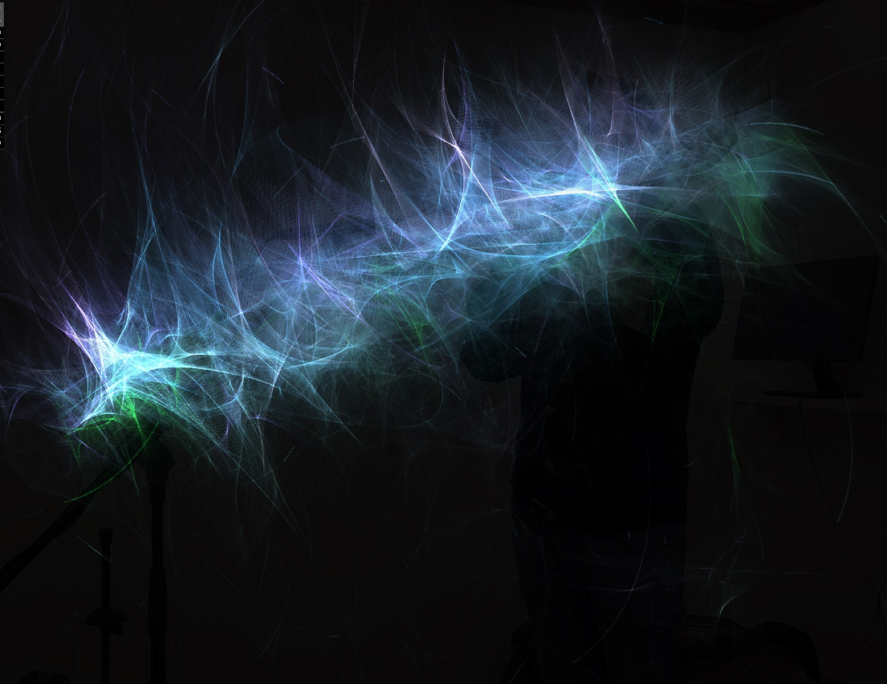

ofxParticleSet 
==============

Introduction
------------
A simple CPU-based particle system with basic physics including some drawing inspired by
Casey Reas' [Software Structures](https://whitney.org/exhibitions/software-structures).

License
-------
ofxParticleSet is distributed under the [MIT License](https://en.wikipedia.org/wiki/MIT_License). See the [LICENSE](LICENSE.md) file for further details. Just add my name somewhere along your project [Steve Meyfroidt](https://meyfroidt.com) whenever possible.

Dependencies
------------
- Core openFrameworks (no external addons required)

Compatibility
------------
Developed against OpenFrameworks v0.12+ (GL 4.1 core context on macOS).

GPU Implementation
------------------
- Particle integration, lifetime decay and neighbor attraction now run entirely inside transform feedback vertex shaders.
- Spatial relationships are handled via a Morton-coded sort uploaded each frame; geometry shaders read the sorted buffers to draw connection lines.
- Per-particle data (position, velocity, spin, color, radius, lifetime) is stored in ping-pong VBOs and mirrored on the CPU for spawning and recycling.
- Example projects must request at least an OpenGL 4.1 core context so that transform feedback, geometry shaders, and texture buffer objects are available.

Usage Notes
-----------
- Supply normalized coordinates (0–1 in both axes) when calling `add()` and when defining velocities; convert from pixel space in your app according to its viewport.
- Call `add()` from the main thread; additions are queued and uploaded before the next GPU update.
- Use the parameter group to tune runtime behavior: `timeStep`, `velocityDamping`, `attractionStrength`, `initialVelocityScale`, `sortNeighborWindow`, `lineFadeExponent`, etc.—they map directly to shader uniforms.
- Strategies work as before: choose points, lines, or both. Connections automatically fade with distance and wrap around the viewport edges.
